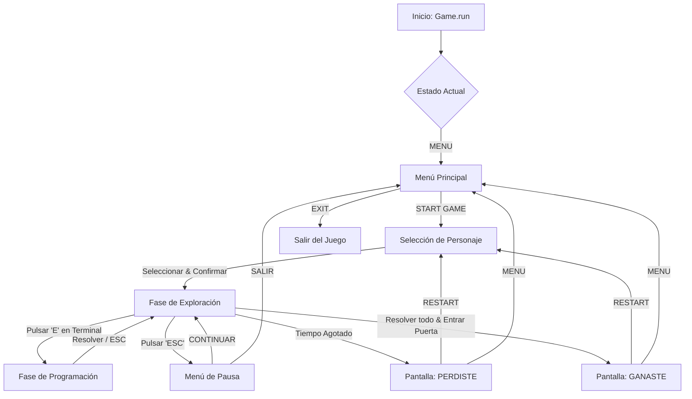

# Documentación del Flujo Completo: Code Escape - Factory Reset

Este documento detalla el funcionamiento lógico y el flujo de navegación del juego, desde el inicio hasta las condiciones de victoria o derrota.

## 1. Diagrama de Flujo Lógico

El juego se rige por una máquina de estados centralizada en la clase `Game` dentro de `src/engine.py`.

---

## 2. Descripción Detallada de los Estados

### 2.1 Menú Principal (`MENU`)
Es el punto de entrada. Permite al usuario iniciar la aventura o salir de la aplicación.
*   **Controles**: Mouse (clic/hover) o Teclado (Flechas + Enter).

### 2.2 Selección de Personaje (`CHARACTER_SELECT`)
Fase previa a la acción donde el jugador elige su identidad.
*   **Personajes Disponibles**: Pepe (Obrero 1), Pedro (Obrero 2), Juan (Obrero 3).
*   **Punto Importante**: El sistema carga dinámicamente el grupo de sprites (frente, espalda, perfil) correspondiente al personaje elegido para ser usado en el gameplay.

### 2.3 Fase de Exploración (`EXPLORANDO`)
Es el núcleo del juego. El jugador se desplaza por la fábrica.
*   **Tiempo Límite**: Determinado por `TIEMPO_LIMITE` en `settings.py`. El tiempo empieza a descontar solo al entrar en este estado.
*   **Misiones**: Localizar las terminales industriales repartidas por el mapa.
*   **Punto Importante**: El tiempo **se pausa** automáticamente si el jugador entra al menú de pausa.

### 2.4 Fase de Programación / Puzzles (`PROGRAMANDO`)
Se activa al interactuar con una terminal ('E').
*   **Objetivo**: Escribir correctamente el snippet de código mostrado.
*   **Consecuencia**: Al resolver todas las terminales (misiones), la puerta de salida de la fábrica se abre visualmente y permite el paso.

### 2.5 Menú de Pausa (`PAUSA`)
Permite detener la acción en cualquier momento mediante la tecla `ESC`.
*   **Gestión de Tiempo**: Se guarda el instante exacto de la pausa para ajustar el cronómetro al reanudar, evitando penalizaciones injustas.

### 2.6 Pantalla de Resultados (`GANASTE` / `PERDIDO`)
Muestra el mensaje de éxito o fracaso.
*   **Estado Perdido**: "PERDISTE - Te has quedado encerrado en la fabrica."
*   **Estado Ganado**: "¡GANASTE! - Has escapado de la fabrica a tiempo."

---

## 3. Puntos Críticos y Reglas de Negocio

1.  **Sincronización de Audio**:
    *   La música de ambiente suena en loop.
    *   Existen alarmas sonoras automáticas cuando restan 10 y 5 segundos.
    *   Sonidos específicos para Error, Victoria y Derrota con manejo de hilos para no bloquear el juego.

2.  **Sistema de Colisiones**:
    *   El `MapManager` define muros y objetos sólidos (Desktop, Tanques, Buzones, etc.) con los que el jugador no puede atravesar.
    *   La puerta es un objeto sólido infranqueable hasta que se completan todas las misiones.

3.  **UI Dinámica**:
    *   La interfaz muestra en tiempo real el "Tiempo restante" y el progreso de las "Misiones".
    *   El título del juego en el menú principal tiene un efecto visual curvo y animaciones de obreros trabajando de fondo.

4.  **Reseteo de Estado**:
    *   Al reiniciar (`reset_game`), se limpian todas las terminales, se resetean las banderas de audio y se vuelve a posicionar al jugador en el punto de spawn inicial.
